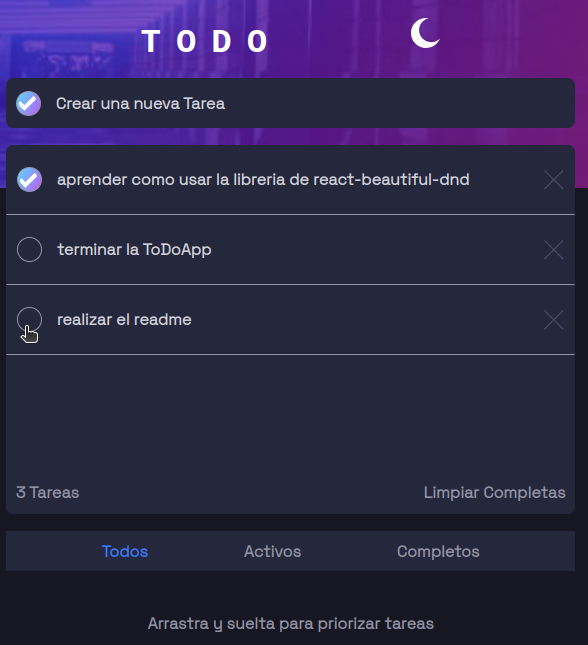
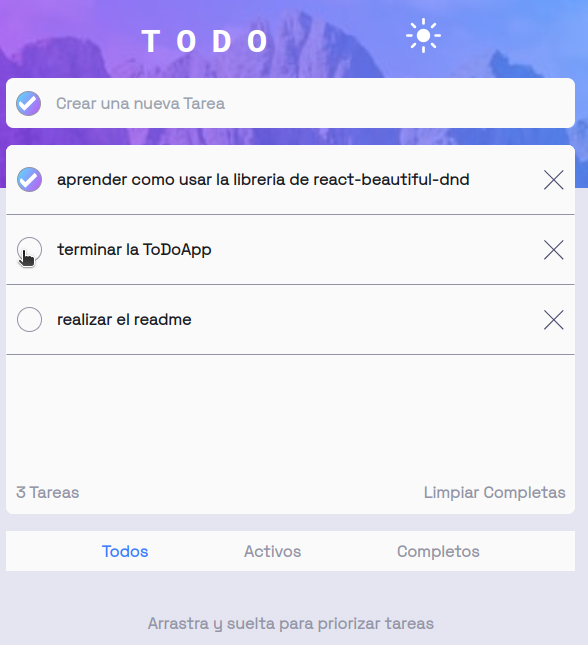

# Frontend Mentor - Todo app solution

This is a solution to the [Todo app challenge on Frontend Mentor](https://www.frontendmentor.io/challenges/todo-app-Su1_KokOW). Frontend Mentor challenges help you improve your coding skills by building realistic projects. 

## Overview

### The challenge

Users should be able to:

- View the optimal layout for the app depending on their device's screen size
- See hover states for all interactive elements on the page
- Add new todos to the list
- Mark todos as complete
- Delete todos from the list
- Filter by all/active/complete todos
- Clear all completed todos
- Toggle light and dark mode
- **Bonus**: Drag and drop to reorder items on the list

### Screenshot

### Links

- Solution URL: [ToDo App in github](https://github.com/anonimussapee/fdo)
- Live Site URL: [ToDo App ](https://dnd-todo-app.netlify.app/)

### Built with

- Semantic HTML5 markup
- CSS custom properties
- Mobile-first workflow
- [React](https://reactjs.org/) - JS library
- [react-beautiful-dnd](https://www.npmjs.com/package/react-beautiful-dnd) - npm library
- [CSS framework](https://tailwindcss.com/) - For styles
- [vite build tool](https://vitejs.dev/) - For the compilation

### What I learned

I learned to use the react-beautiful-dnd library for that I found a course on the internet that helped me in the process.

## Author

- Website - [JDX DEVS](https://jdx.netlify.app/)
- Frontend Mentor - [@anonimussapee](https://www.frontendmentor.io/profile/anonimussapee)
